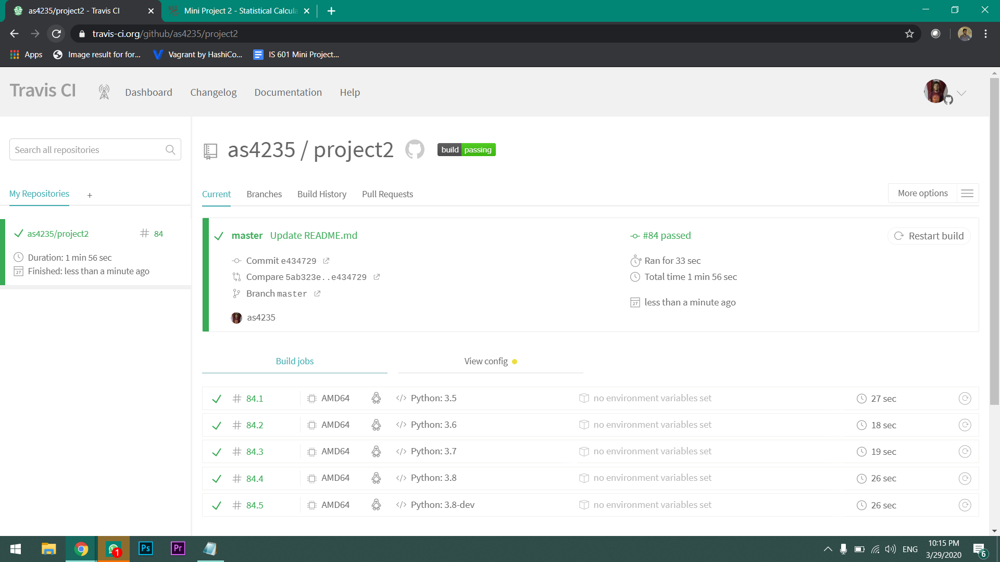

# Mini Project 2

## Team Members

Ajay Kumar Selvaraj Rajagopal, Mohammed Yahya Muhammad Rafih Hassan 

## Ajay Kumar Selvaraj Rajagopal,

- [x] Calculator Module and Test

- [x] Definitions

- [x] CSV read module and Test

- [x] Statistic Module

- [x] Population Mean function and Test

- [x] Median function and Test

- [x] Mode function and Test

- [x] Population Standard Deviation function and test

- [x] Variance of population proportion function and test

- [x] zscore function and test

- [x] standardized score function and test

## Mohammed Yahya Muhammad Rafih Hassan

- [x] Population Correlation Coefficient function and test

- [x] Confidence Interval function and test

- [x] Population Variance function and test

- [x] Proportion function and test

- [x] Sample Mean function and test

- [x] Sample Standard Deviation function and test

- [x] Variance of sample proportion function and test
